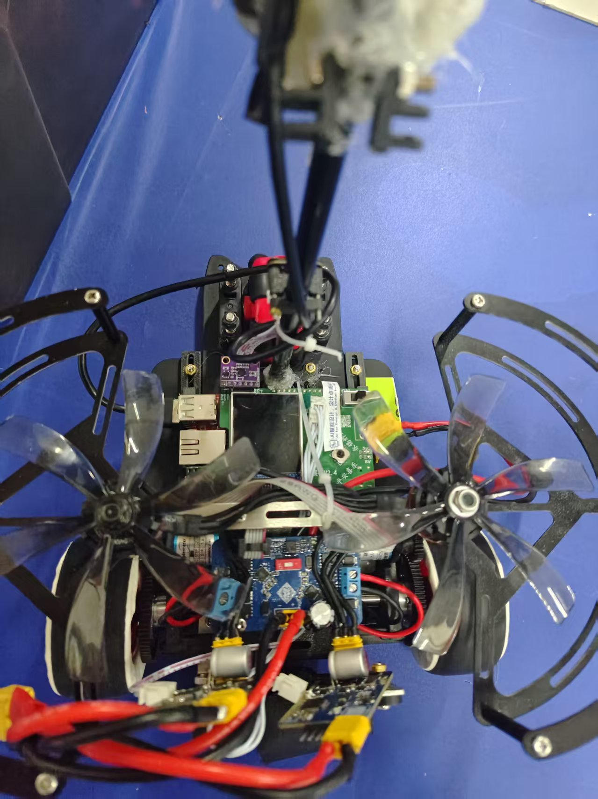
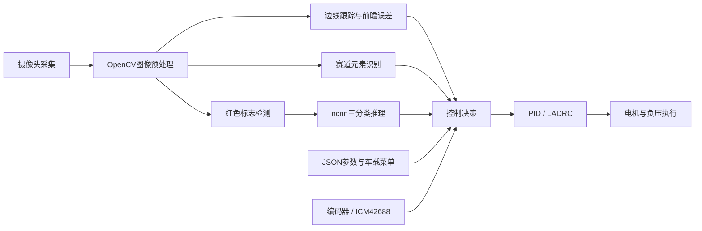
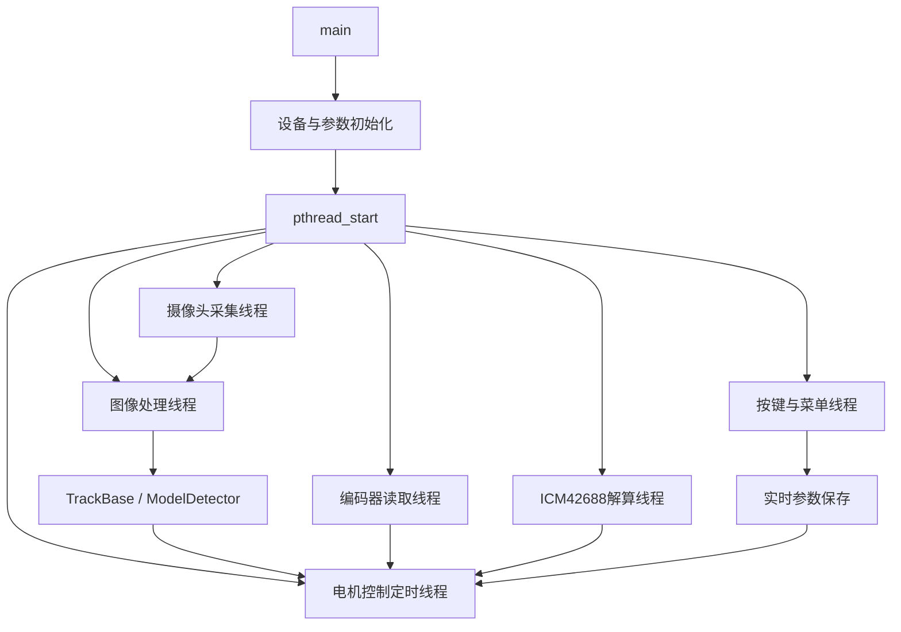

# 走马观碑智能车

基于龙芯久久派（LoongArch Linux）的视觉智能车控制程序，面向智能车竞赛场景，集成实时巡线、赛道元素识别、模型目标分类、多线程控制和车载参数调节。

> 本仓库目前公开的是智能车端应用代码、硬件驱动封装和运行环境文件；模型训练数据、训练脚本和训练权重暂未包含在仓库中。

## 项目概览



项目的运行链路如下：



### 主要能力

- OpenCV 巡线、边线跟踪、中线误差和动态前瞻。
- 直道、弯道、十字、圆环、斑马线、坡道、路障等赛道元素状态机。
- 红色提示框检测、目标板 ROI 裁剪和 ncnn 三分类推理。
- 模型绕行、回线、动作队列和基于编码器的退出控制。
- PID、LADRC、模糊调参和分元素速度决策。
- 摄像头、编码器、ICM42688、LCD、按键、电机、无刷负压等外设控制。
- 图像采集线程、图像处理线程、控制线程、编码器线程和陀螺仪线程并行运行。
- 车载菜单调参、`preprocess.json` 参数保存和 8080 端口图传。

## 硬件与软件环境

| 项目 | 当前配置 |
| --- | --- |
| 主控平台 | 龙芯久久派 / LoongArch Linux |
| 编译器 | `/opt/loongson-gnu-toolchain-13.2` 交叉工具链 |
| 构建工具 | CMake 3.10+、GNU Make |
| 图像处理 | OpenCV |
| 推理框架 | ncnn |
| 参数解析 | jsoncpp |
| 并行计算 | OpenMP / gomp |
| 车载外设 | 摄像头、双电机、编码器、ICM42688、LCD、按键、无刷负压 |

实车照片、图传截图和演示视频可以继续放入 `run/image/`，并在此处补充展示。

## 快速开始

### 1. 获取代码

```bash
git clone https://gitee.com/chao-8xx/car.git
cd car
```

### 2. 准备运行资源

正式实车入口会从当前运行目录加载：

```text
preprocess.json
model_packed.ncnn.param
model_packed.ncnn.bin
```

其中：

- `preprocess.json` 已随仓库提供，用于摄像头、速度、PID、元素和模型参数。
- `model_packed.ncnn.param` / `model_packed.ncnn.bin` 是部署模型，不是训练资源。
- 训练数据、标注、训练脚本和原始训练权重暂未上传。

如果暂时没有部署模型，正式入口会在初始化阶段提示模型加载失败，无法完成完整模型赛题运行。模型文件可以通过项目 Release 或团队内部发布地址提供；下载后请放在程序启动目录，并在文档中附上版本号和 SHA256。

### 3. 编译

推荐从仓库根目录执行：

```bash
./run/build.sh
```

也可以手动构建：

```bash
cmake -S run -B run/build \
  -DCROSSTOOL_DIR=/opt/loongson-gnu-toolchain-13.2
cmake --build run/build -j12
```

构建产物为 `run/build/main`。该工程面向龙芯 Linux 交叉编译环境，不能直接在 Windows 主机上运行。

### 4. 部署

网络文件系统：

```bash
cp run/build/main ~/linux/nfs/lsrootfs/root/
```

通过 EMMC / SSH：

```bash
scp run/build/main root@<久久派IP>:/root/
```

在目标板上运行时，请确保 `main`、`preprocess.json` 和模型文件位于同一工作目录：

```bash
cd /root
./main
```

程序默认启动摄像头、8080 图传服务、模型推理和车载控制线程。使用 `Ctrl+C` 触发安全退出。

## 目录结构

```text
car/
├── run/
│   ├── main.cc                 # 正式实车入口
│   ├── CMakeLists.txt          # 交叉编译配置
│   ├── build.sh               # 一键构建脚本
│   ├── preprocess.json        # 运行参数
│   ├── ipm_config.json        # 逆透视 / 标定参数
│   ├── inr/                   # 项目头文件
│   ├── src/                   # 项目源文件
│   └── image/                 # 文档图片和硬件示意图
├── test/                      # 外设、相机和 ncnn 示例
├── WuwuSama_Icar_Project/
│   ├── smartCar/              # WUWU 外设封装库
│   └── cross_lib/             # OpenCV、jsoncpp、ncnn 交叉编译库
├── system/                    # 内核镜像和根文件系统
├── main.cc                    # 历史版本入口，仅作参考
└── README.md
```

## 运行架构

正式入口由 `run/main.cc` 和 `run/src/pthread_control.cc` 共同组织：



核心代码导航：

| 模块 | 入口 |
| --- | --- |
| 图像采集与图传 | `run/main.cc`、`ww_camera.*`、`ww_camera_server.*` |
| 边线跟踪 | `run/src/vision_tracking_base.cc` |
| 赛道元素状态机 | `run/src/vision_element_state.cc` |
| 模型检测与分类 | `run/src/vision_model.cc` |
| 控制决策 | `run/src/control_decision.cc` |
| 元素控制器 | `run/src/element_control.cc` |
| 参数与菜单 | `run/src/preprocess.cc`、`run/src/Mymenu.cc` |
| 线程调度 | `run/src/pthread_control.cc` |
| 外设封装 | `WuwuSama_Icar_Project/smartCar/` |

## 开发文档

- [运行与开发手册](run/README.md)
- [第三方来源与许可证说明](THIRD_PARTY_NOTICES.md)
- `run/preprocess.json`：车载参数模板
- `run/ipm_config.json`：图像逆透视与标定参数

## 当前开源边界

本仓库公开智能车端代码和部署所需的工程结构；以下内容暂未公开：

- 模型训练数据集与标注；
- 模型训练脚本和训练配置；
- 原始训练权重；
- 完整比赛记录、图传视频和调参过程。

部署模型是否公开、下载地址和版本号应以项目 Release 或后续公告为准。

## 许可证与致谢

本项目代码按 GPL-3.0-or-later 发布，具体范围和第三方组件说明见 [LICENSE](LICENSE) 与 [THIRD_PARTY_NOTICES.md](THIRD_PARTY_NOTICES.md)。

项目使用了 OpenCV、ncnn、jsoncpp、OpenMP 以及 WUWU 智能车外设库。请在再分发时同时遵守对应组件的许可证。

