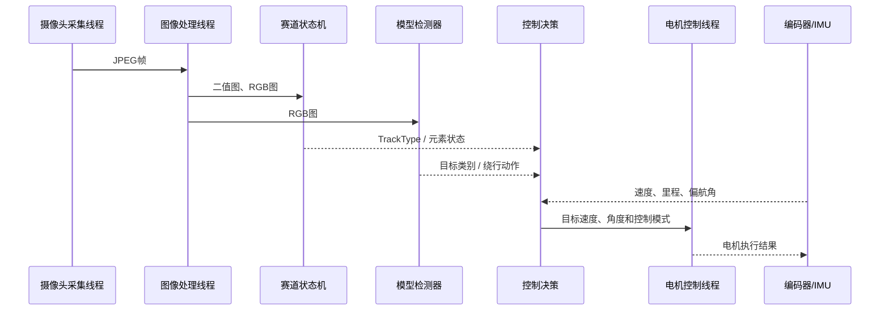

# `run/` 实车程序开发手册

`run/` 是智能车正式应用代码目录。它负责把摄像头、视觉算法、赛道元素状态机、模型推理、控制决策和底层外设组织成一个可部署的 `main` 程序。

## 1. 运行链路



正式程序启动后，主要线程由 `pthread_start()` 创建：

- 摄像头采集线程：获取帧并通过条件变量交给图像处理线程。
- 图像处理线程：翻转图像，执行巡线、元素识别、模型推理和图传。
- 电机控制线程：执行发车、速度决策、PID/LADRC 和元素控制。
- 编码器线程：更新左右轮速度和里程。
- 陀螺仪线程：读取 ICM42688 并计算姿态、偏航角。
- 按键线程：监听车载菜单并实时保存参数。
- 信号线程：处理 `SIGINT/SIGTERM`，停止摄像头、图传和工作线程。

## 2. 目录说明

```text
run/
├── main.cc                    # 正式实车入口
├── CMakeLists.txt             # CMake 与龙芯交叉编译配置
├── build.sh                   # 清理、配置、编译脚本
├── preprocess.json            # 速度、PID、视觉、模型参数
├── ipm_config.json            # 逆透视 / 标定参数
├── inr/                       # 头文件
│   ├── vision_tracking_base.h
│   ├── vision_element_state.h
│   ├── vision_model.h
│   ├── control_decision.h
│   ├── element_control.h
│   └── preprocess.h
├── src/                       # C/C++ 实现
│   ├── vision_tracking_base.cc
│   ├── vision_element_state.cc
│   ├── vision_model.cc
│   ├── control_decision.cc
│   ├── element_control.cc
│   ├── pthread_control.cc
│   └── preprocess.cc
└── image/                     # 文档图片、硬件示意图和演示资源
```

外设驱动封装位于：

```text
WuwuSama_Icar_Project/
├── smartCar/include/
├── smartCar/code/
└── smartCar/wuwu_library/
```

`run/inr` 是项目内部约定的头文件目录名称，请不要在只改文档的情况下擅自重命名目录。

## 3. 环境要求

目标平台为龙芯 LoongArch Linux。推荐环境：

- 交叉工具链：`/opt/loongson-gnu-toolchain-13.2`
- CMake：3.10 或更高
- GNU Make
- OpenCV、jsoncpp、ncnn 和 gomp 已放在 `WuwuSama_Icar_Project/cross_lib/`

如果工具链安装在其他位置，可以通过 `CROSSTOOL_DIR` 传入，不需要修改 CMake 文件。

## 4. 编译

在仓库根目录执行：

```bash
./run/build.sh
```

或者手动执行：

```bash
cmake -S run -B run/build \
  -DCROSSTOOL_DIR=/opt/loongson-gnu-toolchain-13.2
cmake --build run/build -j12
```

成功后生成：

```text
run/build/main
```

构建脚本会重新创建 `run/build`。该目录已被 `.gitignore` 忽略。

## 5. 部署与启动

### 网络文件系统

```bash
cp run/build/main ~/linux/nfs/lsrootfs/root/
```

### EMMC / SSH

```bash
scp run/build/main root@<久久派IP>:/root/
```

目标板上的推荐目录：

```text
/root/
├── main
├── preprocess.json
├── model_packed.ncnn.param
└── model_packed.ncnn.bin
```

启动时必须从上述目录执行：

```bash
cd /root
./main
```

程序默认启动 8080 图传服务。使用 `Ctrl+C` 可触发安全退出流程。

## 6. 配置文件与模型文件

### 参数文件

- `preprocess.json`：摄像头、速度、前瞻、PID/LADRC、圆环、模型和菜单参数。
- `ipm_config.json`：图像逆透视和自动标定相关配置。

车载菜单修改数值后，`Preprocess_save()` 会将参数写回 `preprocess.json`。修改参数前建议备份原文件。

### 模型文件

正式入口使用：

```text
model_packed.ncnn.param
model_packed.ncnn.bin
```

`vision_model.cc` 中当前分类顺序为：

```text
supplies
transport
weapon
```

训练数据、标注、训练脚本和原始训练权重暂未上传。仓库只描述端侧推理接口；如果需要完整运行模型赛题，请从项目 Release 或团队提供的下载地址获取匹配版本的 ncnn 模型，并将两个文件放在程序启动目录。

建议后续为每个模型发布记录：

- 模型版本；
- 输入尺寸与预处理方式；
- 类别顺序；
- 导出工具链；
- 文件 SHA256；
- 与代码版本的对应关系。

## 7. 代码模块职责

| 文件 | 职责 |
| --- | --- |
| `vision_tracking_base.cc` | 图像预处理、边线提取、巡线和误差计算 |
| `vision_element_state.cc` | 赛道元素检测与状态机 |
| `vision_model.cc` | 红框检测、ROI、ncnn 推理和模型动作 |
| `vision_model_queue.cc` | 模型动作队列和触发管理 |
| `vision_biaoding_auto.cc` | 视觉参数自动标定 |
| `control_decision.cc` | 根据元素、速度和模型状态生成控制建议 |
| `element_control.cc` | 直道、弯道、十字、圆环和模型绕行控制 |
| `pthread_control.cc` | 工作线程、定时任务和安全退出 |
| `preprocess.cc` | JSON 参数加载、保存和默认值 |
| `Mymenu.cc` | 车载菜单项与参数绑定 |
| `basic_control.cc` | 发车、停车、速度和执行器基础控制 |

### 赛道元素状态

`TrackType` 当前包含：

```text
normal / crossroad / circle / zebra / ramp / barrier / model
```

圆环、十字、路障、坡道、斑马线和模型绕行各自拥有独立的子状态。状态机负责“识别当前元素”，`control_decision.cc` 和 `element_control.cc` 负责“将状态转换为目标速度、前瞻和电机控制”。

## 8. 调试与测试

`test/` 目录提供外设、摄像头和 ncnn 示例，例如：

- `camera_save_video_main.cc`
- `camera_zeroCopy_main.cc`
- `encoder_main.cc`
- `icm42688_main.cc`
- `Motor_main.cc`
- `Lcd_main.cc`
- `ncnn_yolov5n_example/`
- `ncnn_yolov8cls_n_example/`

这些文件是独立示例，不会自动成为正式 `main`。调试时应根据示例对应的库接口建立独立测试目标或临时替换入口，避免把多个 `main()` 一起加入同一个可执行文件。

模型性能统计可以通过 `preprocess.json` 中的 `model_profile_enable` 和 `model_profile_interval` 开启。实车调试前建议先关闭电机使能，确认图像、编码器、IMU 和模型输出正常。

## 9. 常见问题

### 模型加载失败

确认当前工作目录包含：

```text
model_packed.ncnn.param
model_packed.ncnn.bin
```

并确认模型与当前 `vision_model.cc` 的输入尺寸、层名称和类别顺序匹配。

### 找不到 `preprocess.json`

程序使用相对路径读取配置。请先 `cd` 到 `preprocess.json` 所在目录，再启动 `main`。

### 摄像头或图传启动失败

检查目标板的视频设备权限、摄像头连接和 8080 端口占用；退出时使用 `Ctrl+C`，不要直接强制杀死进程。

### 修改参数后行为异常

先恢复备份的 `preprocess.json`，再逐项调整速度、前瞻和 PID 参数。不要同时修改多个状态机的关键阈值。

## 10. 贡献与许可

新增项目头文件放入 `run/inr/`，新增实现放入 `run/src/`。修改参数结构时请同步更新：

1. `run/inr/preprocess.h`
2. `run/src/preprocess.cc`
3. `run/preprocess.json`
4. `run/src/Mymenu.cc`（如果需要车载调参）

项目代码按 GPL-3.0-or-later 发布。第三方库、WUWU 外设库和再分发要求见仓库根目录的 [LICENSE](../LICENSE) 与 [THIRD_PARTY_NOTICES.md](../THIRD_PARTY_NOTICES.md)。

